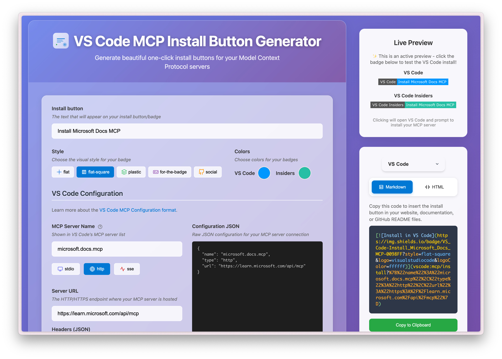

# VS Code MCP Install Button Generator

Handy utility app to help generate VS Code install buttons and links for Model Context Protocol (MCP) servers. Create professional one-click install experiences for your MCP projects with customizable badges and comprehensive configuration support. 

📺 [Watch full demo on YouTube](https://youtu.be/1JcRtQxmh3I)

Try it out live at [VSCodeMCP.com](https://vscodemcp.com)!




Sample buttons:


This tool handles the conversion automatically when generating install buttons.

## ✨ Features

- **🌐 Comprehensive MCP Support:**
  - **stdio**: Configure command execution, arguments, and environment variables
  - **http/sse**: Configure server URLs, custom headers, and authentication

- **🎨 Advanced Badge Customization:**
  - Custom badge text with automatic encoding
  - Full color picker for badge and logo colors
  - Multiple professional styles (flat, flat-square, plastic, for-the-badge, social)
  - Powered by Shields.io for high-quality badge generation

- **📋 Multiple Output Formats:**
  - **Markdown format**: Perfect for README files and documentation
  - **HTML format**: Ready for web pages and blogs

- **⚡ Real-time Experience:**
  - Live preview of generated badges
  - Instant copy-to-clipboard functionality
  - Responsive design for all devices

- **🔗 VS Code Integration:**
  - Generates proper `vscode:mcp/install` URLs
  - Automatic JSON encoding for URL parameters
  - One-click installation experience for end users

## 🚨 Important Configuration Note

**The JSON configuration format used for the VS Code install button is different from VS Code's MCP configuration file format.**

- **For the install button** (this tool): The MCP server name is a key-value pair in the URL parameters
- **For VS Code's `mcp.json` file**: The MCP server name is a parent object containing the configuration

**Example of VS Code MCP configuration format** (used in your `mcp.json` file):

```json
{
  "microsoft.docs.mcp": {
    "type": "http",
    "url": "https://learn.microsoft.com/api/mcp"
  }
}
```

## 🚀 Getting Started

### Quick Start

1. Open `src/index.html` in your web browser, or
2. Visit the live version at [vscodemcp.com](https://vscodemcp.com)

## 📖 Usage

### Step-by-Step Guide

1. **Enter MCP Server Details:**
   - Provide your MCP server name (e.g., `microsoft.docs.mcp`)
   - Choose your preferred configuration mode:
     - **Simple Mode**: Paste JSON configuration directly
     - **Enhanced Mode**: Use the guided form with validation

2. **Configure Server Settings:**
   - **For stdio servers**: Set command, arguments, and environment variables
   - **For http/sse servers**: Set server URL and optional headers

3. **Customize Badge Appearance:**
   - Set custom badge text (defaults to server name)
   - Choose badge and logo colors using the color picker
   - Select from multiple professional styles

4. **Generate and Copy:**
   - Choose output format (Markdown or HTML)
   - Preview your badge in real-time
   - Copy the generated code with one click

5. **Use in Your Project:**
   - Paste the generated code into your README or website
   - Users can now install your MCP server with one click!

## 💡 Example

For a Microsoft Docs MCP server, the app generates professional install buttons:

**Markdown Output:**

```markdown
[](vscode:mcp/install?name=microsoft.docs.mcp&config=%7B%22type%22%3A%22http%22%2C%22url%22%3A%22https%3A%2F%2Flearn.microsoft.com%2Fapi%2Fmcp%22%7D)
```

**HTML Output:**

```html
<a href="vscode:mcp/install?name=microsoft.docs.mcp&config=%7B%22type%22%3A%22http%22%2C%22url%22%3A%22https%3A%2F%2Flearn.microsoft.com%2Fapi%2Fmcp%22%7D">
  
</a>
```

**How it works:**

- Users click the badge → VS Code opens → MCP server installs automatically
- No manual configuration needed for end users
- Perfect for README files, documentation, and project pages

## ⚙️ MCP Configuration Format

The app supports the official VS Code MCP configuration format. Here are the supported connection types:

### stdio Configuration

Perfect for locally executed MCP servers:

```json
{
  "type": "stdio",
  "command": "npx",
  "args": ["-y", "mcp-server-name"],
  "env": {
    "API_KEY": "${input:api-key}"
  }
}
```

### http/sse Configuration

Ideal for remote MCP servers:

```json
{
  "type": "http",
  "url": "https://api.example.com/mcp",
  "headers": {
    "Authorization": "Bearer ${input:token}"
  }
}
```

### Environment Variables

Both configuration types support environment variables using the `${input:variable-name}` syntax, which prompts users for values during installation.

## 🎨 Badge Customization

Powered by [Shields.io](https://shields.io), the app supports extensive customization:

### Available Styles

- **flat**: Clean, modern flat design
- **flat-square**: Flat design with square edges
- **plastic**: Glossy, dimensional appearance
- **for-the-badge**: Large, bold style perfect for prominent placement
- **social**: GitHub-style social badges

### Color Options

- **Hex Colors**: Full hex color support (#FF0000, #667eea, etc.)
- **RGB Colors**: Standard RGB notation
- **Named Colors**: CSS color names (red, blue, green, etc.)
- **Brand Colors**: Automatic brand color detection

### Logo Customization

- **VS Code Logo**: Professional VS Code branding
- **Custom Colors**: Match your project's color scheme
- **High Quality**: SVG-based logos for crisp display at any size

## 🛠️ Technologies Used

- **Frontend**: Pure HTML5, CSS3, and vanilla JavaScript (zero dependencies)
- **Styling**: Modern CSS Grid and Flexbox layouts with responsive design
- **Badge Generation**: [Shields.io](https://shields.io) API for high-quality badge rendering
- **VS Code Integration**: Official `vscode:mcp/install` URL scheme
- **Accessibility**: WCAG compliant with semantic HTML and proper ARIA labels

## 🤝 Contributing

Contributions are welcome! This project aims to make MCP server installation as simple as possible.

### Development

1. Clone the repository
2. Open `src/index.html` in your browser
3. Make your changes
4. Test thoroughly across different browsers
5. Submit a pull request

### Reporting Issues

Found a bug or have a feature request? Please open an issue on GitHub with:

- Clear description of the problem or feature
- Steps to reproduce (for bugs)
- Browser and OS information
- Expected vs actual behavior

## 📄 License

See LICENSE file for details.

## 🔗 Links

- **Live App**: [vscodemcp.com](https://vscodemcp.com)
- **GitHub Repository**: [merill/vscode-mcp](https://github.com/merill/vscode-mcp)
- **VS Code MCP Documentation**: [Official MCP Docs](https://modelcontextprotocol.io)
- **Shields.io**: [Badge Service](https://shields.io)

---

**Made with ❤️ for the MCP community** | Create beautiful install experiences for your Model Context Protocol servers
